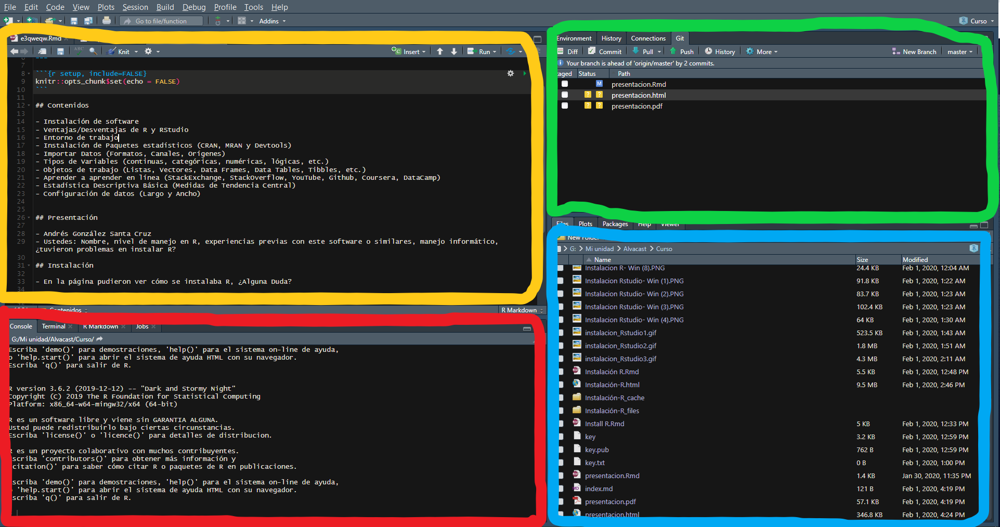

```{r setup_theme0, include = FALSE}
rm(list=ls());gc()
if(!grepl("4.1.2",R.version.string)){stop("Different version (must be 4.1.2)")}


options(servr.daemon = TRUE)
```

```{cat, engine.opts=list(file = "mylibs/zoom.html"), include=F}
<script src="https://lab.hakim.se/zoom-js/js/zoom.js" type="text/javascript"></script>
<script type="text/javascript">
	slideshow.on( "beforeHideSlide", function( slide ) {
		zoom.out();
	} );
	slideshow.on( "afterShowSlide", function( slide ) {
		document.querySelector( ".remark-visible" ).addEventListener( "dblclick", function( event ) {
			event.preventDefault();
			zoom.to( {element: event.target} );
		} );
	} );
</script>
```

```{r setup, include = FALSE}
local({r <- getOption("repos")
       r["CRAN"] <- "https://cran.dcc.uchile.cl/"
       options(repos=r)
})

if(!require(pacman)){install.packages("pacman")}
pacman::p_load(devtools, here, showtext, ggpattern, RefManageR, pagedown, magick, bibtex, DiagrammeR, xaringan, xaringanExtra, xaringanthemer, fontawesome, widgetframe, datapasta, tidyverse, psych, tidyverse, cowplot, pdftools, showtext, compareGroups, ggiraph, sf, distill, data.tree,
               widgetframe, install= T)

if(!require(xaringanBuilder)){devtools::install_github("jhelvy/xaringanBuilder",upgrade = "never")}
if(!require(icons)){remotes::install_github("mitchelloharawild/icons",upgrade = "never")}

test_fontawesome<- function(x="github"){
tryCatch({
  invisible(fontawesome::fa(name = x))
  return(message("fontawesome installed"))
},
# ... but if an error occurs, tell me what happened: 
error=function(error_message) {
  message("Installing fontawesome")
  icons::download_fontawesome()  
})
}

vec_col<-c("#660600","#6F3930","#745248","#786B60","#E6E6E6","#738FBC","#003891","#3C5279","#786B60","#B48448","#EF9D2F","#D99155","#E3D1C2","#E0BC9E","#ABB0BF","#835F69","#5A0D13")
plot_prueba<-barplot(1:length(vec_col), col=vec_col)

#https://coolors.co/21177a-fe4a17-788aa3-45503b
xaringanthemer::style_duo( #ABB0BF
  primary_color = "#FFFFFF",  #555555 gris oscuro
  secondary_color = "#DD3333",#"#FF5252"))) 
  text_color = "#333333", #bc7777
  text_bold_color = "#FF5252",
  #base_color = '#bc7777',
  background_position = 'center',
  header_font_google = google_font("Lato"),#Josefin Sans
  text_font_google   = google_font("Lato", "400", "400i"),
  code_font_google   = google_font("Lato"),
  code_font_size = '53%', #sirve
  padding = "0.4em 2.4em 0.4em 2.4em",
  extra_fonts = list(google_font("Arial Narrow")),
 # title_slide_background_image = "./_figs/bg_portada.svg",
#  title_slide_background_size = "cover",
 # background_image = "./_figs/bg.svg",
  background_size = "cover",
  extra_css =
  list(
  ".remark-slide-scaler" = list("overflow-y" = "auto"), # para no tener limites de extensión
 # ".remark-slide-number" = list("display" = "none"), #oculta el reloj también
 # "pre"= list("line-height"= "0.2em"),
  ".gray"   = list(color = "#aaaaaa"),
  ".black"   = list(color = "#bc7777"),
  ".darkgreen"   = list(color = "#45503B"),
  ".darkred"   = list(color = "#591F0A"),
  ".small" = list("font-size" = "90%"),
  ".pull_c" = list("float" = "center","width" = "30%", "height" = "50%", "padding-left" = "40%"),
  ".pull_c_title" = list("height" = "90%"),
  ".pull_l_70" = list("float"= "left","width"= "72%", "font-size"= "90%"),
  ".pull_r_30" = list("float"= "right","width"= "23%", "font-size"= "90%"),
  ".pull_left"  = list("float"= "left","width"= "47%", "height"= "100%", "padding-right"= "2%"),
  ".pull_right" = list("float"= "right","width"= "47%", "height"= "100%", "padding-left"= "2%"),
  ".small_left"  = list("float"= "left", "width"= "47%", "height"= "50%", "padding-right"= "2%"),
  ".small_right" = list("float"= "right","width"= "47%", "height"= "50%", "padding-left"= "2%"),
  ".left_code" = list("float"="left","width"="47%","height"="100%","padding-right"="2%",    "font"="Roboto"),
  ".code_out"  = list("float"="right","width"="47%","height"="100%","padding-left"="2%",    "font"="Roboto"),
  ".text_180" = list("font-size" = "180%"),
  ".text_170" = list("font-size" = "170%"),
  ".text_160" = list("font-size" = "160%"),    
  ".text_150" = list("font-size" = "150%"),
  ".text_140" = list("font-size" = "140%"),  
  ".text_130" = list("font-size" = "130%"),
  ".text_120" = list("font-size" = "120%"),
  ".text_110" = list("font-size" = "110%"),
  ".text_110" = list("font-size" = "110%"),
  ".text_100" = list("font-size" = "100%"),
  ".code_10" = list("code-inline-font-size"= "60%",
                    "overflow-y" = "scroll !important",
                    "overflow-x" = "scroll !important",
                    "max-height" = "5vh !important",
                    "line-height"= "0.75em"),
   ".code_10_pre" = list("code-inline-font-size"= "60%",
                    "overflow-y" = "scroll !important",
                    "overflow-x" = "scroll !important",
                    "max-height" = "15vh !important",
                    "line-height"= "0.75em",
                    "min-height"="0.5em"
                    ),
  ".code_15" = list("code-inline-font-size"= "15%",
                    "overflow-y" = "scroll !important",
                    "overflow-x" = "scroll !important",
                    "max-height" = "10vh !important"),
  ".text_90" = list("font-size" = "90%"),
  ".text_80" = list("font-size" = "80%"),
  ".text_70" = list("font-size" = "70%"),
  ".text_65" = list("font-size" = "65%"),
  ".text_60" = list("font-size" = "60%"),
  ".text_50" = list("font-size" = "50%"),
  ".text_40" = list("font-size" = "40%"),
  ".text_30" = list("font-size" = "30%"),
  ".text_20" = list("font-size" = "20%"),
  ".line_space_15" = list("line-height" = "1.5em;"),
  ".line_space_13" = list("line-height" = "1.3em;"),
  ".line_space_11" = list("line-height" = "1.1em;"),
  ".line_space_15" = list("line-height" = "1.5em;"),
  ".line_space_09" = list("line-height" = "0.9em;"),
  ".line_space_07" = list("line-height" = "0.7em;"),
  ".line_space_05" = list("line-height" = "0.5em;"),
  ".largest" =  list("font-size" = "2.488em;"),
  ".larger" =  list("font-size" = "2.074em;"),
  ".large" =  list("font-size" = "1.44em;"),
  ".small" =  list("font-size" = "0.833em;"),
  ".smaller" =  list("font-size" = "0.694em;"),
  ".smallest" =  list("font-size" = "0.579em;"),
  ".limity150" = list("max-height" = "150px;",
                     "overflow-y" = "auto;"
      ),
    ".tiny_text" = list(
      "font-size"= "70%"
      ),
    ".large_text" = list(
      "font-size"= "150%"
      ),
    ".slide_blue" = list(
      "background-color" = "#FEDA3F",
      "color" = "#3C3C3B"
      ),
  ".center_image" = list(
    margin  = "0",
    position = "absolute",
    top      = "50%",
    left     = "50%",
    '-ms-transform' = "translate(-50%, -50%)",
    transform = "translate(-50%, -50%)"
    ),
    ".center_down_image" = list(
    margin  = "0",
    position = "absolute",
    top      = "90%",
    left     = "50%",
    '-ms-transform' = "translate(-50%, -50%)",
    transform = "translate(-50%, -50%)"
    ),
    "slides > slide" = list(
    "overflow-x"  = "auto !important",
    "overflow-y" = "auto !important"
    ),
 #   "pre" = list(
#    "white-space"  = "pre !important",
#    "overflow-y" = "scroll !important",
#    "max-height" = "40vh !important",
#    "font-size" = "0.8em"
#    ),
    ".superbigimage" = list(
    "white-space"  = "nowrap",
    "overflow-y" = "scroll"
    )
  )
)

options(htmltools.preserve.raw = FALSE)


#knitr::opts_chunk$set(comment = NA) # lo saqué pa probar por si
knitr::opts_chunk$set(dpi=720)
#options(htmltools.preserve.raw = FALSE)#A recent update to rmarkdown (in version 2.6) changed how HTML widgets are included in the output file to use pandoc's raw HTML blocks. Unfortunately, this feature isn't compatible with the JavaScript markdown library used by xaringan. You can disable this feature and resolve the issue with htmlwidgets in xaringan slides by setting
#https://stackoverflow.com/questions/65766516/xaringan-presentation-not-displaying-html-widgets-even-when-knitting-provided-t/65768952#65768952


xaringanExtra::use_progress_bar(color = "#12636B", location = "top")#, height = "550px")
xaringanExtra::use_animate_css()
xaringanExtra::use_scribble() #son los lapices
xaringanExtra::use_tile_view()
xaringanExtra::use_panelset()
xaringanExtra::use_editable(expires = 1)
xaringanExtra::use_fit_screen()

#https://gist.github.com/gadenbuie/61b27108ceec6c7a55cd9966609128d7

# padding-top: 0.4em;
# padding-right: 2.4em;
# padding-bottom: 0.4em;
# padding-left: 2.4em;
invisible("https://www.youtube.com/watch?v=M3skTMQbCD0")
invisible("https://zane.lol/slides/adirondack/#39")
#https://titanwolf.org/Network/Articles/Article?AID=3896fe2c-1b3b-4ebd-9906-1f9ed1675b35#gsc.tab=0
#https://annakrystalli.me/talks/xaringan/xaringan.html#55
#https://bookdown.org/yihui/rmarkdown/some-tips.html
#https://arm.rbind.io/slides/xaringan.html#90
#https://stackoverflow.com/questions/62069400/font-size-of-figure-in-xaringan-slide-too-small
#https://irene.vrbik.ok.ubc.ca/blog/2021-07-14-xaringan-slides/

#https://evamaerey.github.io/doublecrochet/
#devtools::install_github("paulhendricks/anonymizer")
check_code <- function(expr, available){
  if(available){
    eval(parse(text = expr))
  } else {
    expr
  }
}
path2<-dirname(rstudioapi::getSourceEditorContext()$path)
#knitr::opts_chunk$set(message = FALSE,warning = FALSE, error = FALSE)

```


```{r, load_refs, include=F, eval=T, cache=FALSE}
library(RefManageR)
BibOptions(check.entries = FALSE,
           bib.style = "numeric",
           cite.style = "numeric",
           style = "markdown",
           super = TRUE,
           hyperlink = FALSE,
           dashed = FALSE)
warning(paste0(path2,"/libreria_generica.txt"))

myBib <- ReadBib(paste0(path2,"/libreria_generica.txt"), check = FALSE)

```


class: title-slide, middle, right 

<br>

<br> 
 
.line_space_15[ 
## .text_80[Taller <br> de Reforzamiento]
]

<br>

.line_space_11[
    
<br>

.text_70[[Código en: `r fontawesome::fa(name = "github")`](https://github.com/AGSCL/Taller_UDP)]

.text_110[Clase 1. Proyectos en R]

]

<!---
- Trabajar en proyectos en R (convenciones y buenas prácticas para guardar y abrir datos, códigos, referencias, salidas de código, figuras, etc.)
- Visualización de datos mediante ggplot (lógica de capas, propiedades de los gráficos, paquetes estadísticos complementarios ) 
La aplicación de estos contenidos se hará mediante ejercicios de estadística descriptiva y modelos de regresión logística en R

http://observatorio.ministeriodesarrollosocial.gob.cl/encuesta-social-covid19-cuarta-ronda
--->

.bg-text[


`r withr::with_locale(new = c('LC_TIME' = 'es_ES'), code =format(Sys.time(),'%d de %B, %Y'))`


.text_100[Andrés González Santa Cruz]

.text_65[gonzalez.santacruz.andres@gmail.com] [`r fontawesome::fa(name = "github")`](https://github.com/AGSCL) [`r fontawesome::fa(name = "orcid", fill="green")`](https://orcid.org/0000-0002-5166-9121)
]

<br>
  
```{r echo=FALSE, out.width = '15%'}
knitr::include_graphics('./_style/cropped-logotipo_fsch.png')
```

???
*#_#_#_#_#_#_#_#_#_#_
**NOTA**
*#_#_#_#_#_#_#_#_#_#_

- Mi nombre es andrés gonzález. Soy asistente de investigación de un proyecto milenio de políticas sobre drogas y trabajo para Alvaro Castillo en la Universidad Mayor en el Centro de Investigación en Sociedad y Salud. También estudio un doctorado en Salud pública en la Universidad de Chile
- Ustedes: Nombre, nivel de manejo en R, experiencias previas con este software , manejo informático, expectativas
- Es de carácter introductorio a R y Rstudio
- No es un curso de estadística
- No soy un experto en informática ni en estadística
- Es un taller enfocado a la aplicación de herramientas básicas de gestión de datos en R y Rstudio
- Brinda herramientas, guía y orientación para profundizar de manera individual
- **Deben tener experiencia previa con R. Aquí no instalaremos R desde 0**
- Otra cosa: si usted no puede asistir algún día, pero decide asistir el día siguiente y me solicita ayuda por algo visto el día anterior, tendrá última prioridad respecto a quienes tienen preguntas referentes al día de hoy, y de quienes asistieron el día anterior pero igual tienen dudas de ese día.

---
layout: true
class: animated, fadeIn
---
## Índice

- Proyectos en R: Configurarlo, guardar conjuntos de datos, lógica de directorio, convenciones y buenas prácticas para guardar y abrir datos, códigos, referencias, salidas de código, figuras, etc.

- Visualización de datos mediante ggplot: lógica de capas, propiedades de los gráficos, paquetes estadísticos complementarios 

- (Extra: De ser posible, Aplicación en estadística descriptiva y modelos de regresión en R)

.center[
.black[
  **Siempre y cuando sea posible**
]
]

???
*#_#_#_#_#_#_#_#_#_#_
**NOTA**
*#_#_#_#_#_#_#_#_#_#_

- Dicho esto, vamos al grano

---
class: partial-bg inverse center, middle

background-image: linear-gradient(45deg, #ABB0BF, #555555)
<!---#DD3333--->

## Partamos

---
## Entorno/Espacio de Trabajo

- Oprima `Cntrl + Alt + Shift 0`
<div class="yellow">- Editor de texto o códigos (ACTUALIZACION: Editor Visual Markdown)</div>
<div class="green">- Lugar de trabajo (objetos creados, funciones, historial, control de versiones) (ACTUALIZACION: Se agregó Tutorial)</div>
<div class="red">- Consola para desplegar los comandos y obtener resultados</div>
<div class="blue">- Multitabla (gráficos, carpetas, paquetes, visor páginas web) (ACTUALIZACION: Se agregó "Presentation")</div>

```{r Fig Entorno, fig.align="center", message=FALSE, warning=FALSE, cache=T, eval=F, echo =F, out.width = "700px"}
#
image_colorize(image_read(path = "https://github.com/AGSCL/Taller-UDP-2022/raw/main/_figs/entorno_de_trabajo.PNG"),15,"red")
```

```{r Fig-ent, fig.align="center", message=FALSE, warning=FALSE, cache=T, echo =F, out.width = "750px"}

# Now call back the plot
background <- image_read("_figs/entorno_de_trabajo.png")
# And bring in a logo
logo_raw <- image_read("https://i.imgur.com/e1IneGq.jpg") 

frames <- lapply(logo_raw, function(frame) {
  image_composite(background, frame, offset = "+70+800")
})

animation <- image_animate(image_join(frames))
animation

#image_write(animation, "_figs/dir_Travolta.gif")
```

???
*#_#_#_#_#_#_#_#_#_#_
**NOTA**
*#_#_#_#_#_#_#_#_#_#_
Comentarios:
- Cntrl+ Shift +H : Paara definir el entorno de trabajo.//Cmd + D: Para cambiar el entorno de trabajo
- Editor de sintaxis: Formato block de notas, no ejecuta la sintaxis, comentarios se agregan anteponiendo el signo gato, puede predecir comandos, se ejecuta con cntrl+enterp "run"
- Consola y visor resultados: Con un enter se ejcutarán, cambiarán de color una vez ejecutados, los errores arrojarán mensajes, ejecutar operaciones no es lo mismo que guardarlas, se ejecuta cuando hay un signo ">", no hay un mensaje de stop en la esquina superior derecha.
- Entorno de trabajo: Memoria interna programa y uso de memoria RAM, entorno de trabajo temporal, objetos almacenados.
- Visualizador: permite acceder a CRAN, manuales, etc.

---
## Entorno de Trabajo (2)

- Rstudio permite crear un **Proyecto** (.Rproj), agrupa a todos los elementos. Puede gestionar los proyectos aquí:

```{r Fig rproj, fig.align="center", message=FALSE, warning=FALSE, cache=T, echo =F, out.width = "250px"}
#, out.width = "250px"
knitr::include_graphics("./_figs/rproj.png")
```

- **Directorio:** Ubicación en la que alojaré archivos que formarán parte del entorno de trabajo. Se obtiene mediante `getwd()`. **Configurarlo es muy importante (`setwd([RUTA])`).**
- **.rds:** Permite guardar bases de datos de manera individual (muy similar a una hoja excel, un archivo .csv, etc.)
- **.Rdata:** Permite guardar múltiples datos, objetos, funciones, etc., lo que equivale a decir que permite guardar el espacio de trabajo en general (`save.image(file =[RUTA])` para guardar todo, `save` para guardar sólo ciertos objetos en un .Rdata, `load([RUTA])` para restaurar). De igual forma, puede hacerlo desde aquí:

```{r Fig save_load_image, fig.align="center", message=FALSE, warning=FALSE, cache=T, echo =F, out.width = "250px"}
knitr::include_graphics("./_figs/guardar_load_rdata.png")
```

- **.R:** Una especie de archivos de texto en el que se pueden guardar comandos, anotaciones, etc. Similar a un archivo `.do` o sintaxis. Se recomienda que antes de cerrar una sesión, uno pueda guardar los scripts. **.Rdata no es lo mismo que .R, RECUÉRDELO**.

???
*#_#_#_#_#_#_#_#_#_#_
**NOTA**
*#_#_#_#_#_#_#_#_#_#_
PROYECTOS: que agrupa/incorpora los distintos elementos de más abajo. Se recomienda crear uno siempre que se trabaje en un proyecto de investigación nuevo. Además, se recomienda asignarle una carpeta de trabajo individual, que pueda estar respaldada constantemente (ojo: cuidado con Google Drive). 

- Igual uno puede guardar un solo archivo con `save(data_cons, file = "OUT/data3.RData")`

- asdasd
 
 
---
## Tips/Recomendaciones

- `here::here()` permite saber cuál es la ubicación del directorio en vez de utilizar un directorio fijo.

- `rm(list = ls())` si bien puede ser útil, no empieza un proceso de R totalmente limpio, sino que elimina objetos creados en el espacio de trabajo.

- `renv()`, en un proyecto permite tener los paquetes de R actualizados hasta cierta fecha, junto con sus dependencias (snapshot)

- `rstudioapi::getSourceEditorContext()$path`, permite también tener una ubicación relativa de su proyecto.

- `GitHub`, control de versiones, colaboración, etc.

```{r Fig r-script-tip, fig.align="center", message=FALSE, warning=FALSE, cache=T, echo =F, out.width = "350px"}
knitr::include_graphics("./_figs/DQugFIWUEAErq0D.jpg")
```

- Vea las opciones de su proyecto

```{r Fig open_save_load_script, fig.align="center", message=FALSE, warning=FALSE, cache=T, echo =F, out.width = "350px"}
knitr::include_graphics("./_figs/DQugFIWUEAErq0D.jpg")
```

???
*#_#_#_#_#_#_#_#_#_#_
**NOTA**
*#_#_#_#_#_#_#_#_#_#_
PROYECTOS: 

- Uno ve cuándo actualiza RENV (sus paquetes etc). Aunque es medio inestable, creo que es una gran opción.
- 


---
## Tips/Recomendaciones (2)

**¿Cómo preguntar algo en R?**

.pull_c[

- Stackoverflow, twitter, grupos en R

- `dput()` base de datos hipotética o real*

- Markdown

- Precisión

]


???
*#_#_#_#_#_#_#_#_#_#_
**NOTA**
*#_#_#_#_#_#_#_#_#_#_

- Siempre antes busque en español e inglés si su pregunta fue planteada anteriormente (para que no la marquen como duplicada y reciba una mala calificación por flojo)

- Real siempre y cuando la desanonimice (`anonymizer`) o no sea la base de datos completa (filtre)

- `dput(mtcars)`: permite exportar la estructura de la base de datos para quien le ayude sepa cómo se ordenan sus datos y eventuales dependencias o clases de valores. Si bien puede apoyarse con una imagen de sus datos, es recomendable que use dput()

- Maneje algo de lenguaje markdown para hacer más entendible su pregunta

- No aburra, sea preciso. 

- Les dejo un ejemplo mío: https://stackoverflow.com/questions/63290366/mutate-across-multiple-variables-using-a-list-of-third-variables-in-r

- Otro en español: https://es.stackoverflow.com/questions/566778/loop-sobre-varios-objetos-con-nombres-parcialmente-com%c3%ban

- StackOverflow (https://es.stackoverflow.com/). Por ejemplo, Testeo de modelo lineal en R (https://es.stackoverflow.com/questions/331075/testeo-de-modelo-lineal-en-r)

- **Otros tips**: Incluya tags o palabres clave; revise con un compañere antes de publicar, responda adecuadamente al recibir retroalimentación, revise redacción, aunque en el título sea pragmático. Sea agradecido (upvote)


---
## Tips/Recomendaciones (3)

**Cursos**

- DataCamp. Por ejemplo, Introduction to R (https://www.datacamp.com/courses/free-introduction-to-r)

- Si usted quiere tener una prueba gratis de DataCamp, más allá de completar el primer capítulo de un curso (https://www.datacamp.com/blog/how-to-get-10-years-of-free-datacamp-if-youre-a-teacher-or-student)

- Statistics With Interactive R Learning(SWIRL): The easiest and the most interactive way to start learning R (https://swirlstats.com/students.html) [Youtube](https://youtu.be/w6L7Ye18yPE).

- edX. Por ejemplo, Dat Science: R Basics (https://www.edx.org/es/course/data-science-r-basics), o Introduction to R for Data Science (https://www.edx.org/es/course/introduction-to-r-for-data-science-2).

- YouTube. 

- Estación Lastarria (https://www.estacionlastarria.cl/actividades/rstudio/rstudio-ciencias-sociales.html)

- Centro de Microdatos UChile (https://www.microdatos.cl/analisis-datos-r)

- Introduction to R (https://www.quantargo.com/courses/course-r-introduction/)

**Comunidades**

-  R-Ladies (https://twitter.com/rladiessantiago)

- UseRChile Usuarios de R en Chile (https://userchile.cl/)

**Otros**

- learnr (Etiqueta “Tutorial”)

- CheatSheets. https://rstudio.com/resources/cheatsheets/

- Memes

- Twitter, Pachá (@pachamaltese) y Hadley Wickham (@hadleywickham)

- Rpubs. Páginas alojadas que permiten ver cómo cada persona obtuvo un determinado producto a partir de un código

???
*#_#_#_#_#_#_#_#_#_#_
**NOTA**
*#_#_#_#_#_#_#_#_#_#_

- Por ejemplo, Estadística Útil (https://www.youtube.com/watch?v=rzw1E6HxBFY&list=PLfX5C7cc6LRJ7V6WNgatRQJ6PNMrb4zfM) Riffomonas Project  (https://www.youtube.com/c/RiffomonasProject), Population Data BC (https://www.youtube.com/channel/UCavuC5RfLRUv_8XZxYDR0FA), Econometrics, Causality, and Coding with Dr. HK (https://www.youtube.com/c/NickHuntingtonKlein), Sacha Epskamp (https://www.youtube.com/c/SachaEpskamp1), Paul Dickman (https://www.youtube.com/channel/UC0IZswgRCFX3FYagJ_-ODTg), NHSR Community (https://www.youtube.com/c/NHSRCommunity) Online Causal Inference Seminar (https://www.youtube.com/channel/UCiiOj5GSES6uw21kfXnxj3A)

**PEDIRLES QUE BAJEN DE GITHUB EL REPOSITORIO DE LAS CLASES**

---
## Ejemplo


.details-code[

```{r ej0, message=FALSE, warning=FALSE, echo=T}
path<-
list.files("./", full.names = TRUE, recursive = TRUE)

library(data.tree)
library(plyr)

a <- lapply(strsplit(path, "/"), function(z) as.data.frame(t(z)))
a <- rbind.fill(a)
mytree <- data.tree::as.Node(data.frame(pathString = path))
mytree

```

]

???
*#_#_#_#_#_#_#_#_#_#_
**NOTA**
*#_#_#_#_#_#_#_#_#_#_
PROYECTOS: 

- Este es un proyecto que tiene una serie de carpetas, que se conecta a Github (control de versiones), etc.
- Esta es la estructura de datos que hay en su interior
- Veamos qué contiene: hay un "american-medical-association-10th-edition.csl", para insertar un formato de referencias
- Hay múltiples css para dar el estilo y diseño a la presentación y páginas en su interior
- Estan los .RMDs y los .HTMLs
- Carpetas: data, figs, output, style (ahí deberían ir los .css y todo lo que tiene relación con los temas, pero también van las fuentes de letra, etc.)

---
## Ejercicio 2
- Su jefe le pide que vea los datos guardados en el proyecto de R adjunto en el enlace.

- Abra el siguiente [enlace](https://github.com/AGSCL/Taller-UDP-2022/raw/main/_data/ejercicio2.zip) y baje los datos.

- Abra el proyecto, el .Rdata pero no el script 

- Vea las primeras 6 filas del objeto `base_datos`

- OPC. Vea las primeras 3 filas

- ¿A qué llegó?

```{r ej2, include=F}
##script, comentario
set.seed(112);base_datos<-data.frame(esto=rnorm(1:100))

head(base_datos) 
#1 -0.3142317
#2  2.4033751
#3 -0.7182640
#4 -1.7606110
#5 -1.1252812
#6 -0.7195406

head(base_datos,3)
# -0.3142317
#  2.4033751
# -0.7182640

head_base_datos<-capture.output(head(base_datos,3)) #capturamos lo que la consola nos entrega en un objeto
```

---
## Ejercicio: Hágalo usted

- Cree un nuevo proyecto en R

- Genere la siguiente base de datos recurriendo a este código: `set.seed(6789); df2<- data.frame(numeros=round(rnorm(1:300)*100,0))`

- Utilizando `tail(df2)` obtenga las últimas 6 observaciones

- Súmelas

- ¿Llegó al siguiente número: `r set.seed(6789); df2<- data.frame(numeros=round(rnorm(1:300)*100,0));sum(tail(df2))`?

- OPC1 = obtenga la media de todos los números (use recursos en línea)

- OPC2 (+ avanzada)= obtenga el resultado usando comas como separador de decimales ("outdec" en internet)

- OPC3 = Obtenga la desviación estándar, separando los decimales con comas

- Guarde los datos y el proyecto

- Reinicie el computador. Vuelva a abrirlos

```{r hagalo_usted, include=F}
set.seed(6789); df2<- data.frame(numeros=round(rnorm(1:300)*100,0))

#Utilizando tail(df2) obtenga las últimas 6 observaciones. Súmelas
sum(tail(df2))

#OPC1 = obtenga la media de todos los números (use recursos en línea)
tail_df2<-tail(df2)

mean(tail_df2$numeros)

#OPC2 (+ avanzada)= obtenga el resultado usando comas como separador de decimales (“outdec” en internet)
options(OutDec= ",")
mean(tail_df2$numeros)

#OPC3 = Obtenga la desviación estandar, separando los decimales con comas
options(OutDec= ",")
sd(tail_df2$numeros)
```


???
*#_#_#_#_#_#_#_#_#_#_
**NOTA**
*#_#_#_#_#_#_#_#_#_#_
**Ejercicio: Hágalo con su compañere**
- En la carpeta `_data`, encontrará 2 ejercicios con nombre: **1a** y **1b**.
- Ejecute el .RMD, genere con él un proyecto y 
- Guarde la .Rdata con nombre 1a o 1b según corresponda (**NADA MÁS**)
- Compártalo con un compañere
- En aquel proyecto que le compartieron, sólo abra el .RData, despliegue el 
- resultado alojado en el objeto **"plot"**


---
class: center, middle

# Gracias!

<br>
  
<div class="centered"> Contacto: gonzalez.santacruz.andres@gmail.com </div>

<br>

<br>

<br>

```{r, echo=FALSE,  fig.align="center", out.width=300, error=T}

knitr::include_graphics('./_style/cropped-logotipo_fsch.png')

```
<br>
  

---
## Fuentes

- Boccardo, Giorgio & Ruiz, Felipe. (2018). Uso de RStudio para Estadística Univariada en Ciencias Sociales. Manual de apoyo docente para la asignatura Estadística Descriptiva (1a. Edición). 10.13140/RG.2.2.32783.48803. https://github.com/feliperuizbruzzone/Uso-de-R-para-Estadistica-Social/blob/master/Boccardo%20%26%20Ruiz%20(2018).%20Uso%20de%20RStudio%20para%20Estad%C3%ADstica%20Univariada%20en%20Ciencias%20Sociales%20%5B19%20%20julio%5D.pdf

- Cano, E. & Moguerza, J. (2015). “R desde el principio. Curso ceRo de R”. Ediciones del Orto, Madrid. ISBN 84-7923-526-8. http://emilio.lcano.com/pub/cero/R-desde-el-principio-curso-cero-V1.02.pdf

- R Development Core Team (2000). Introducción a R. Notas sobre R: Un entorno de programación para Análisis de Datos y Gráficos. Versión 1.0.1
https://cran.r-project.org/doc/contrib/R-intro-1.1.0-espanol.1.pdf

- Bryan, J. (2017, Diciembre 12). Project-oriented workflow. https://www.tidyverse.org/blog/2017/12/workflow-vs-script/

- RStudio Support (2022, Octubre 16). Using RStudio Projects. https://support.rstudio.com/hc/en-us/articles/200526207-Using-Projects

- Stackoverflow. How do I ask a good question?. https://stackoverflow.com/help/how-to-ask

```{r exp, eval=F,echo=F, results="asis"}
library(pagedown)

#para exportar la presentación a PDF
pagedown::chrome_print(gsub(".Rmd",".html",rstudioapi::getSourceEditorContext()$path),output="pres_2022_3.pdf")
xaringanBuilder::build_pdf(gsub(".Rmd",".Rmd",rstudioapi::getSourceEditorContext()$path),complex_slides = TRUE,output_file="pres_2022_4.pdf")
xaringanBuilder::build_pdf(gsub(".Rmd",".Rmd",rstudioapi::getSourceEditorContext()$path),complex_slides = TRUE,output_file="pres_2022_5.pdf")
```
